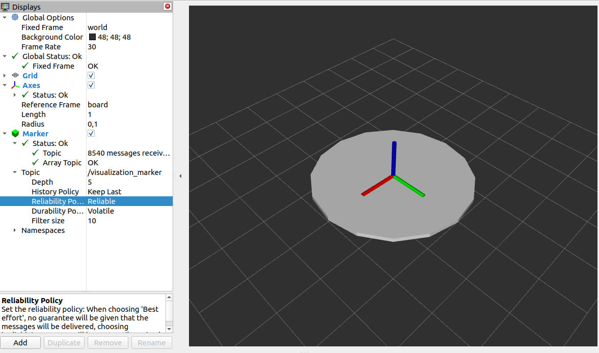

# project hints

## Recording the data

All data sent as topics in ROS can be easily recorded (and replayed later) using rosbag mechanism.

- Recording the data

    `ros2 bag record *topic_list*`

     for example:

    `ros2 bag record /tf /visualization_marker`

- Checking if data was recorded correctly

    `ros2 bag info *bagname*`

- Replaying the bag

    `ros2 bag play *bagname*`

More information may be found in https://docs.ros.org/en/foxy/Tutorials/Beginner-CLI-Tools/Recording-And-Playing-Back-Data/Recording-And-Playing-Back-Data.html

## vizualization hint

If you want to vizualize roll and pitch data in rviz2 you may use Marker message type together with broadcasting transformation frame in `/tf` topic. 

An example how to do that may be found in the `rollpitch_simulator.py` file.
Run it with `ros2 run bip_package tf_simulator`.

In `rviz2` you need to add Marker display, with `/visualization_marker` topic and fixed frame set to `world`. You may also add Axes display with `board` reference frame to see the frame attached to the object.

Finally you should see the image similar to the one below, animated according to random roll and pitch angles. 

